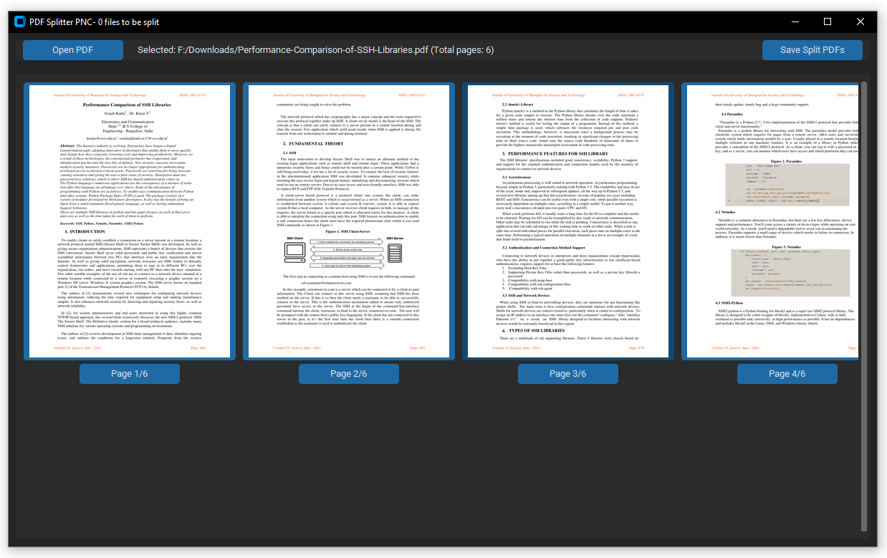

**PDF Splitter Application**  
*Developed by ChatGPT*

---



The PDF Splitter application is a graphical user interface (GUI) tool designed to simplify the process of splitting PDF files. Built using `customtkinter` for a modern and user-friendly interface, and `PyMuPDF` (fitz) for efficient PDF handling, the app provides users with an intuitive experience.

### Key Features:

**1. Open and View PDFs:**
- Select PDF files easily through a file dialog.
- Instantly view thumbnails of each page in a convenient, scrollable, and grid-based layout.

**2. Select Pages for Splitting:**
- Click thumbnails to visually mark pages for splitting.
- Preview pages in detailed full-screen views, with options to rotate pages for better visibility.

**3. Perform PDF Splitting:**
- Quickly define split points by selecting pages.
- Choose an output directory to save the resulting split PDF files.
- Automatically generate separate PDFs based on selected markers.

**4. Easy Access to Output Folder:**
- Open the folder containing the split PDFs directly from within the application.

### Technologies and Libraries Used:
- **GUI Framework:** `customtkinter` (supports dark mode and modern UI aesthetics).
- **PDF Processing:** `PyMuPDF (fitz)` for rendering and manipulating PDF documents.
- **Image Handling:** `Pillow (PIL)` to manage and display page thumbnails and previews.

### Packaging Instructions:
Use the provided PyInstaller command to compile the script into a standalone executable:

```shell
pyinstaller --onefile --noconsole --hidden-import fitz --hidden-import PIL --hidden-import customtkinter smart_pdf.py --name \"PDF-Splitter_1.0.exe\"
```

This command generates a single executable (`PDF-Splitter_1.0.exe`) that runs independently without displaying a command-line window.

